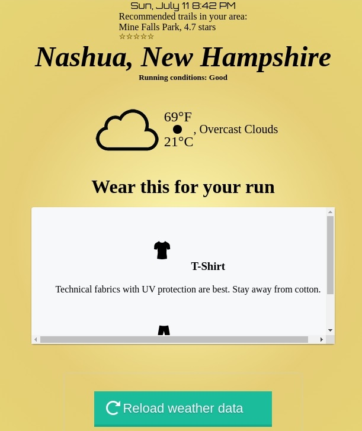

# RunningWeatherGidget | JS, HTML, CSS | Side Project

Running Weather Gidget is a chrome extension that allows someone to make an informed decision before deciding to go on a run. This includes possible storm alerts, recommended clothing choices based on the current weather, local running trails and pertinent weather conditions.

